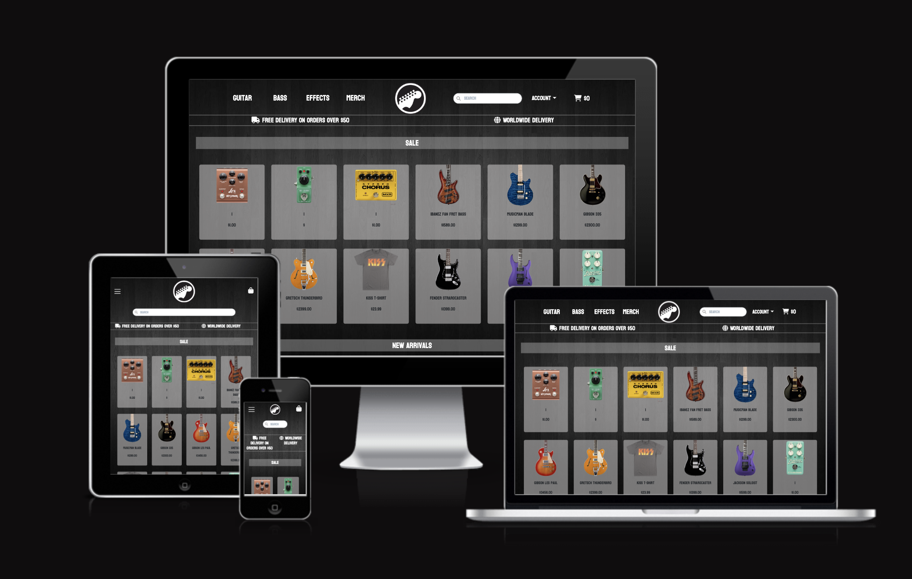
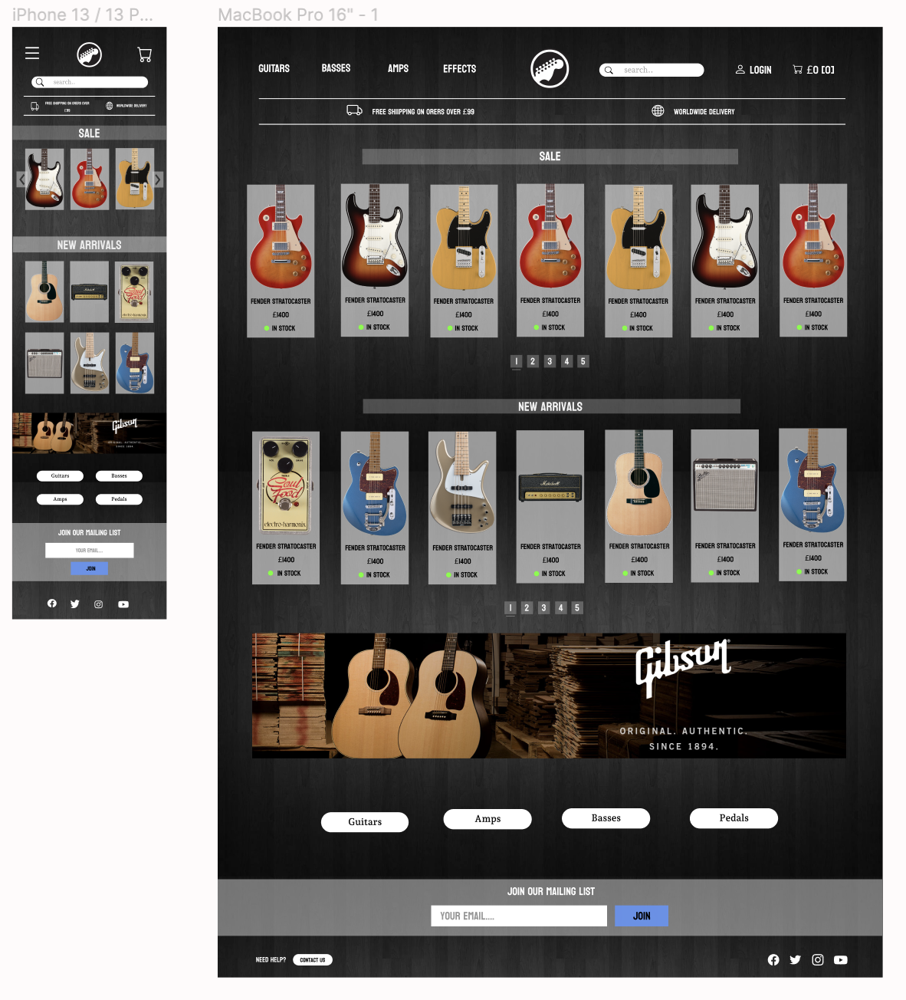
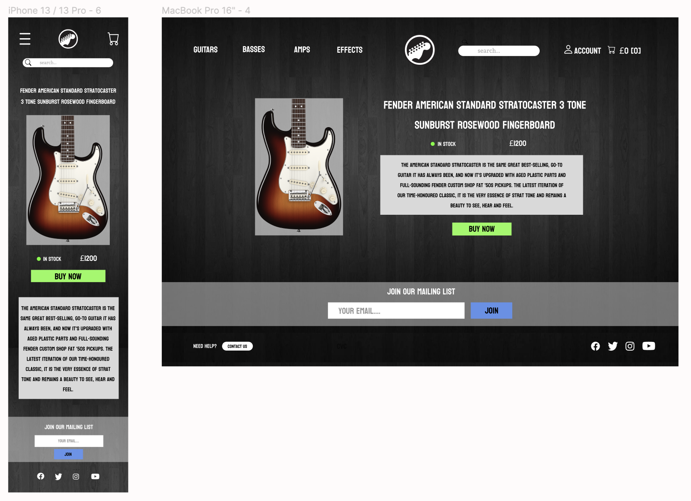
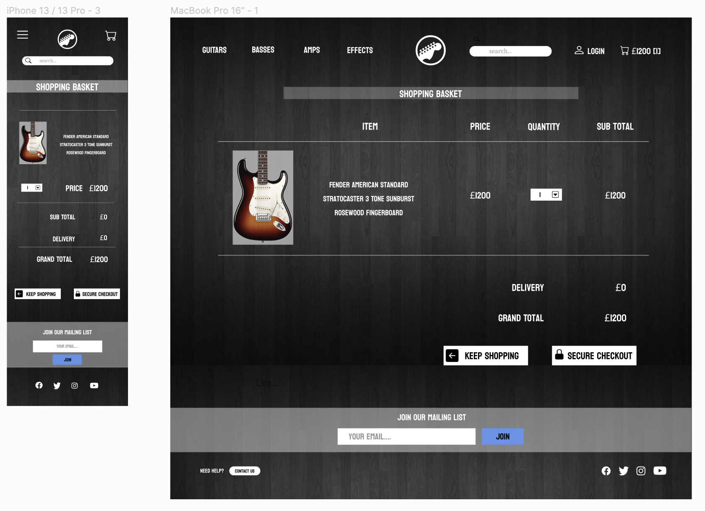
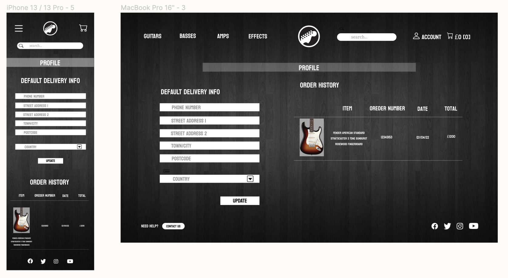
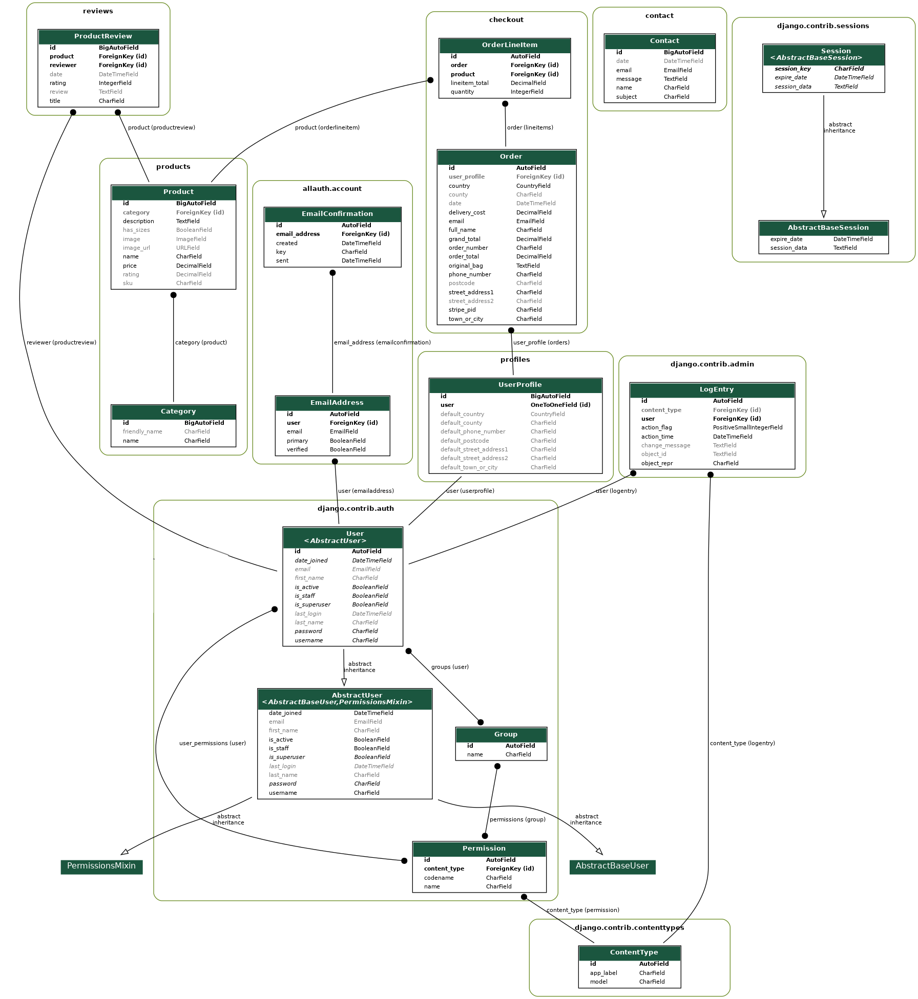

**Full Stack Frameworks with Django Milestone Project**


 
[Link to Live Website](https://guitar-boutique.herokuapp.com/)

## Project goals 

The goal of this project was to create an interactive web store for musicicans and guitar lovers to buy and explore products. The site should be easy to navigate and appealing to the target audience.

## User Stories:

### Unregistered user goals

1. As a first time user, I want to easily understand the purpose of the website.
2. As a first time user, I want to be able to easily navigate throughout the site to find content.
3. As a first time user, I want to view all the items sold on the site, sorted by categories.
4. As a first time user, I want to be able to search the product range.
5. As a first time user, I want to be able to add items to my basket and receive feedback when I interact with the website.
6. As a first time user, I want to to edit and/or delete the items in my basket and receive feedback when something has changed.
7. As a first time user, I want to search the product range.
8. As a first time user, I want to be able to contact the site owners with and issues/queries.
9. As a first time user, I want to be able to visit the website on every device with formatting appropriate for all screen sizes.
10. As a first time user, I want to register an account on the website. 
11. As a first time user, I want to be able to buy items with a card. 
12. As a first time user, I want to be able to review items on the website.

### Registered user goals

1. As a returning user, I want to log in to my profile and update any personal information.
2. As a returning user, I want to see and review my past orders.
3. As a returning user, I want to be able to logout of my profile. 


### Admin

1. As a admin user, I want to be able to add, edit and delete items from the product range.
2. As a admin user, I want to see and review my past orders.
- As an admin user, I should be able to add, edit and delete items from the product range.
- As an admin user, I should have access to an admin section to see details of users and orders.


### Design 

- #### Colour scheme 
I used a dark backround contrasted with white text to give modern look to the website.

- **The black colour** is used in the backround image. 
- **The white colour** is used in most of the text for the site to achive the desired contrast. 
- **The grey colour** is used in product cards and title backrounds to ass interest to images and frame them in a visually appealing way. 

- #### Fonts
I chose the Koulen font as after much testing in my wireframes I felt it suited the site best for achiving a modern yet rustic design to my site.

- #### Icons
The icons used are all font awesome icons, I chose this library due to its large selection of choices. 

- #### Images
The images I used for this project came from [PNG Item](https://www.www.pngitem.com/). These images are used on all the product cards as I wanted images with no backround to fit in with my cards. 

## Wireframes

#### Home Page


#### Product Page


#### Bag


#### Profile



### Existing features 

#### Design 
- An attractive and simple layout with consistency.
- Simple navigation throughout the website by using the navigation bar. 
- Of all product information.
- Consitent design throughout.

####  General 
- Responsive header that changes options if the user is logged in/out. 
- Contact info in footer. 
- Responsive on all devices and screen sizes. 
- Reactive elements that respond to user input (buttons). 

#### Products
- Products can be created, read, updated and deleted (CRUD) by the site admin. 
- Products are displayed by category, this is displayed in the navbar.
- Users can search for products. 
- Users can view information about each product along with reviews.

#### Bag
- Users can add/delete items to the bag. 
- Users can update product quantity in the bag.
- Users can see the total price of the order. 
- Users can continue browsing the site while the bag is stored.

#### Checkout
- Users can input their delivery information into the checkout. 
- Card payments are accepted via Stripe.

#### Profile
- Users can store their personal information in the profile page. 
- Previous orders can be viewed.

#### Reviews
- Registerd users can add reviews to products.
- The author of the review and edit/delete the review.  

#### Contact
- Users can submit a contact form incase they need to gen in contact with the store owner.


#### Search functionality
- Users can search all products on the site by name, description or category.

#### Toasts

- Toasts are popups to give users instant visual feedback when they interact with the website.
- They can also be used to contain information about the current basket, or give error/warning messages.


### Django-allauth feature

- Allauth is Django extension that allows easy user authentication for this website.
- Templates for logging in a resetting paswords were pre made and customized to match the website.

### Automatic e-mails

- Emails are sent to the user for the purpose of account authentication, order confirmation and contact form confirmation.

### Features left to implement in the future 
- Newsletter to allow constant updates for registered users  
- The user can delete their profile to remove their information from the database (Data Protection Laws).
- Ability to show stock levels of products in real time.
- Full card functionality, Stipe is currently in test mode.

## Database

### Schema
Django uses SQL databases by default, I was using SQLite in development. In Heroku once deployed it switches to a PostgreSQL database for deployment which was hosted by AWS.

The schema contains many related tables, a large proportion are created by Django and Allauth by default, below I have described those created custom by myself.

#### Product Review
Takes in the username of the current logged in user and creates a review connected to currently viewed product

#### Product
Collects all products available on the site, contains information on name, description, price, sizes and image.

#### Category
Sorts the products into seperate types to allow easier navigation for the user.

#### Order
Stores all past orders of each users which can be accessed later.

#### User Profile
Collects the username and email for the purpose of login authentication and applying to orders and reviews

#### Contact
Stores messages sent by users to the site admin
      
### ERD


# Technologies

The website is designed using following technologies:

## Programming languages

* HTML - the project used HTML to define structure and layout of the web page;
* CSS - the project used CSS stylesheets to specify style of the web document elements;
* JavaScript - the project used JavaScript to implement Stripe, EmailJS and custom Javascript.
* Python - the project back-end functions are written using Python.

## Libraries

* [Font Awesome](https://fontawesome.com/v4.7.0/) - Font Awesome icons were used throughout the web-site.
* [jQuery](https://jquery.com/) - is a JavaScript library designed to simplify HTML DOM tree traversal and manipulation.

## Frameworks & Extensions

* [Django](https://www.djangoproject.com/) – Django is a high-level Python Web framework that encourages rapid development and clean, pragmatic design.
* [Bootstrap](https://getbootstrap.com/) – Bootstrap is a web framework that focuses on simplifying the development of informative web pages.
* [EmailJS](https://www.emailjs.com/) – Service that helps sending emails using client side technologies only. It only requires to connect EmailJS to one of the supported email services, create an email template, and use their Javascript library to trigger an email.
* [Stripe](https://stripe.com/ie) – Allows individuals and businesses to make and receive payments over the Internet.

## Database
* [Heroku Postgres](https://www.heroku.com/postgres/) – PostgreSQL is one of the world's most popular relational database management systems.

## Others

* [GitHub](https://github.com/) - GitHub is a global company that provides hosting for software development version control using Git.
* [Gitpod](https://gitpod.io/workspaces/) - One-click ready-to-code development environments for GitHub.
* [Heroku](https://dashboard.heroku.com/) - Heroku is a cloud platform that lets companies build, deliver, monitor and scale apps.
* [AWS-S3](https://aws.amazon.com/s3/) – Object storage service that offers industry-leading scalability, data availability, security, and performance.

# Testing

**Testing section is located [here](/testing.md)**

### Validating code

* HTML
code is validated through [W3 validator](https://validator.w3.org/).

* CSS
code is validated through [W3 Jigsaw](https://jigsaw.w3.org/css-validator/).

* JavaScript
code is validated through [JS Hint](https://jshint.com/).

* Python
code is validated through [PEP8](http://pep8online.com/).


# Deployment

The project was deployed to Heroku and can be found [here](https://sea-and-shore-store.herokuapp.com/).

The following steps were taken throughout the project to achieve deployment of the live site.

## Create Github Repository

- The repository was created using the green 'new' button on [Github](https://github.com/) and selecting the Code Institute Full Template from the dropdown menu. 
- Once created I was able to open the repository in Gitpod using the installed extension. From this point on, the command line in Gitpod was used for version control with git add, commit and push commands.


## Create Django Application
In the terminal type the following commands to create and initialise the project:
    
- Install Django
    ```
    pip3 install django
    ```

- Create project-level application
    ```
    django-admin startproject [project_name] .
    ```

- Create Superuser to access the Django admin panel. Follow the prompts to input a username, email and password.

Note: This step will be repeated when deploying to Heroku and migrating the database to Postgres.

    ```
    python3 manage.py createsuperuser
    ```
- Install apps to implement site features.

    ```
    python3 manage.py startapp [app_name]
    ```

## Deployment to Heroku

In order to deploy the app via [heroku](https://dashboard.heroku.com/apps), the following steps must be taken. 

### Heroku
- Navigate to [heroku](https://heroku.com/) and create a new app in your dashboard.

- Assign an app name and region and hit 'create app'.

- Navigate to the resources tab from the app dashboard, search for Postgres and select to add to the project.

### Django

- To use Postgress, install the following packages.

    ```
    pip3 install dj_database_url
    ```
    ```
    pip3 install psycopg2_binary
    ```
- Add the packages to the requirements.txt file using the following command.

    ```
    pip3 freeze > requirements.txt
    ```

- In settings.py:
    - import dj_database_url.

    ```python
    import dj_database_url
    ```
    - Replace settings for the development database with the following code. Note that the database url is obtained using an environment variable set up in Heroku to avoid exposing the database when pushing to Github. The database settings were also placed in a conditional statement to allow use of development database if necessary.

    ```python
    if 'DATABASE_URL' in os.environ:
        DATABASES = {
            'default':dj_database_url.parse(os.environ.get('DATABASE_URL'))
        }
    else:
        DATABASES = {
            'default': {
                'ENGINE': 'django.db.backends.sqlite3',
                'NAME': os.path.join(BASE_DIR, 'db.sqlite3'),
            }
        }
    ```

- Create fixtures files to be installed in the new database. For my project I required data already added for the Product, Category and ProductVariation models.
    ```
        python3 manage.py dumpdata products.Product > products.json
        python3 manage.py dumpdata products.Category > category.json
        python3 manage.py dumpdata products.ProductVariations > product_variations.json
    ```

- Migrate the project models to database.
    ```
    python3 manage.py migrate
    ```

- Use the created fixtures files to add the product data to the database. Note that the order is important to allow model relationships to be made correctly.

    ``` 
    python3 manage.py loaddata category
    python3 manage.py loaddata products
    python3 manage.py loaddata product_variations
    ```
- Create superuser for the production database and admin panel. Follow the prompts to input a username, email and password.

    ```
    python3 manage.py createsuperuser
    ```

- The Postgress database is now set up and configured.

- Install Gunicorn and create Procfile.
    ```
    pip3 install gunicon
    ```
    ```
    touch Procfile
    ```
- Within the Procfile, place the following code.
    ```
    web: gunicorn sea_and_shore.wsgi:application
    ```

- Login to Heroku and prevent static files being collected until AWS is setup.
    ```
    heroku login -i
    ```
    ```
    heroku config:set DISABLE_COLLECTSTATIC=1 --app <app name>
    ```

- Add Heroku to the allowed hosts in settings.py. 'Localhost' is kept in place for use in future development.
    ```python
    ALLOWED_HOSTS = ["[heroku_app_name].herokuapp.com", "localhost"]
    ```

- Set up remote to Heroku app and push files to Heroku.
    ```
    heroku git: remote -a [heroku_app_name]
    ```
    ```
    git push heroku main
    ```

- On Heroku.com, navigate to the deploy tab of the app dashboard to locate the project Github repository and enable automatic deployment from future pushes to Github.

### Amazon Web Services (AWS)

Amazon Web Services was used to host the static files and media files for the site.

- Follow the steps on the [AWS website](https://aws.amazon.com/) to create a new account and sign in.

- Search for and navigate to the S3 service and follow the following steps to create a new 'bucket'
    - In the S3 dashboard, click the 'create bucket' button.
    - Give the bucket a name, select the region nearest to your location and un-check the 'block public access' settings checkbox.
    - Hit 'create bucket'

- Configure the properties for the bucket.
    - In the properties tab of the bucket, navigate to the 'Static website hosting' section and click edit.
    - Enable Static website hosting using the checkbox.
    - Input the default index and error documents as 'index.html' and 'error.html'.
    - Save changes.

- Configure the permissions for the bucket.
    - In the permissions tab of the bucket.
    - Select edit in the Cross-origin resource sharing(CORS) section and
     pPaste the following code into the CORS configuration section.
    ```
    [
        {
            "AllowedHeaders": [
                "Authorization"
            ],
            "AllowedMethods": [
                "GET"
            ],
            "AllowedOrigins": [
                "*"
            ],
            "ExposeHeaders": []
        }
    ]
    ```
    - Back in the permissions menu, hit edit on the bucket policy section and select 'generate policy'.
        - Select policy type of 'S3 bucket policy'
        - Allow all principles by entering a '*' in the Principal field.
        - Select 'get object' from the action dropdown.
        - Copy the 'arn' from the edit bucket policy page and paste into the Amazon Resource Name (ARN) field.
        - Click 'add statement'
        - Click generate policy and copy the code.
        - Paste the code into the policy field in the edit bucket policy section, adding a '/*' to the resource line.
        - Hit save.
    

    - Navigate to the 'edit access control list (ACL) section and grant 'list' access for everyone by selecting the checkbox.

- Create a user to access the S3 bucket using IAM.
    - Navigate to the IAM page from the AWS dashboard.
    - Create group.
        - Select 'group' from the menu and click to create a new group, following the instructions to name and then create.
    - Create policy
        - Select 'policies' from the menu and click 'create policy'.
        - Select the 'JSON' tab and click 'import managed bucket'.
        - Search for, and import the 'S3 full access' policy.
        - Copy the ARN from the bucket policy section and paste this in as the 'Resource' value.
        - Click 'review policy' and give it a name and description and hit 'create policy.
    - Add policy to group.
        - Navigate to the groups menu and select the group.
        - Click 'attach policy', search for the newly-created policy from the previous step.
        - Select the policy using the checkbox and click 'attach policy'
    - Create user
        - Select 'users' from the menu and click 'add user'.
        - Name the user and grant programatic access using the checkbox.
        - Select the group created in the previous steps.
        - Click through to the end of the options and click 'create user'
        - Download and save the user CSV file.

- Connect Django to S3
    - Install packages Boto3 and Django storages and add to our requirements.txt file.
    ```
    pip3 install boto3
    ```
    ```
    pip3 install django-storages
    ```
    ```
    pip3 freeze > requirements.txt
    ```
    - Add 'storages' to the installed apps in settings.py.
    - Add the following settings to settings.py. Note the 'USE_AWS' environment variable will be added to Heroku to allow use of AWS only when desirable.
    ```python
    if 'USE_AWS' in os.environ:
    # Cache control
    AWS_S3_OBJECT_PARAMETERS = {
        'Expires': 'Thu, 31 Dec 2099 20:00:00 GMT',
        'CacheControl': 'max-age=94608000',
    }
    # Bucket Config
    AWS_STORAGE_BUCKET_NAME = '[bucket name]'
    AWS_S3_REGION_NAME = 'eu-west-2'
    AWS_ACCESS_KEY_ID = os.environ.get('AWS_ACCESS_KEY_ID')
    AWS_SECRET_ACCESS_KEY = os.environ.get('AWS_SECRET_ACCESS_KEY')
    AWS_S3_CUSTOM_DOMAIN = f'{AWS_STORAGE_BUCKET_NAME}.s3.amazonaws.com'
    # Static and media files
    STATICFILES_STORAGE = 'custom_storages.StaticStorage'
    STATICFILES_LOCATION = 'static'
    DEFAULT_FILE_STORAGE = 'custom_storages.MediaStorage'
    MEDIAFILES_LOCATION = 'media'
    # Override static and media URLs in production
    STATIC_URL = f'https://{AWS_S3_CUSTOM_DOMAIN}/{STATICFILES_LOCATION}/'
    MEDIA_URL = f'https://{AWS_S3_CUSTOM_DOMAIN}/{MEDIAFILES_LOCATION}/'
    ```
    - Add the environment variables 'AWS_ACCESS_KEY_ID' and 'AWS_SECRET_ACCESS_KEY' to Heroku with the values found the user CSV file downloaded from the AWS setup.

    - Create custom_storages.py at the top-level of the project and input the locations for Django to store the files.
    ```python
    from django.conf import settings
    from storages.backends.s3boto3 import S3Boto3Storage
    class StaticStorage(S3Boto3Storage):
        location = settings.STATICFILES_LOCATION
    class MediaStorage(S3Boto3Storage):
        location = settings.MEDIAFILES_LOCATION
    ```

- With all these settings complete, remove the 'DISABLE_COLLECTSTATIC variable from Heroku and AWS is ready to use.

- Add media to AWS
    - Navigate to the S3 bucket on the AWS site.
    - Click to create a new folder and name it 'media'
    - Within the folder, click the button to upload files and add any relevant site media.
    - Under permissions, select to grant public read access.
 


## Forking the repository in GitHub
Forking the repository creates a copy of the original repository in your own account to allow changes to be made without affecting the original repository.
1. Log in to GitHub and navigate to the GitHub repository page [here](https://github.com/Tommahawk65/MS4).
2. In the top-right of the page, below the user avatar, locate the "fork" button.
3. Click the "fork" button and you should now have a copy of the repository in your own account. 

## Making a Local Clone
Details of how to make a local copy of the GutHub repository can be found [here](https://docs.github.com/en/github/creating-cloning-and-archiving-repositories/cloning-a-repository). To clone using HTTPS follow these steps.
1. Navigate to the GitHub repository [here](https://github.com/Tommahawk65/MS4).
2. Click the "Code" drop-down menu above the list of files.
3. Copy the HTTPS address to the clipboard using the button provided.
4. Open Terminal.
5. Change the current directory to the location you wish to copy the directory.
6. Type 'git clone' and then paste the HTTPS url you copied earlier. 
7. Press enter and your local clone will be created. 

<h1>6. Credits</h1>

-   All Recipes and Recipe images are from [PNG](www.pngitem.com)

-   [Bootstrap](https://https://getbootstrap.com/) : Bootstrap has been used throughout this project. I have taken examples from the website to form the grid layout, carousel, forms, buttons, navbar and footer.

-   Background image from (https://wallpapercave.com/black-website-background)

<span id="acknowledgements"></span>

<h1>7. Acknowledgements</h1>

-   My Mentor for continuous helpful feedback.

-   Tutor support at Code Institute for their support.


